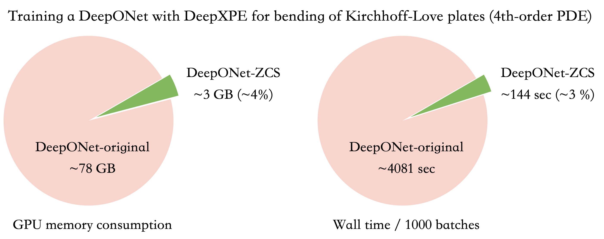

# ZeroCoordinateShift
 
This is the repository for the following paper: 

*Kuangdai Leng, Mallikarjun Shankar, Jeyan Thiyagalingam. Zero Coordinate Shift: Whetted Automatic Differentiation for Physics-informed Operator Learning. 
2023.*

Abstract:
Automatic differentiation (AD) is a critical step in physics-informed machine learning, required for computing the high-order derivatives of network output w.r.t. coordinates. In this paper, we present a novel and lightweight algorithm to conduct this type of AD for physics-informed operator learning, as we call the trick of Zero Coordinate Shift (ZCS). Instead of making all sampled coordinates leaf variables, ZCS introduces only one scalar-valued leaf variable for each spatial or temporal dimension, leading to a game-changing performance leap by simplifying the wanted derivatives from "many-roots-many-leaves" to "one-root-many-leaves". ZCS is easy to implement with current deep learning libraries; our own implementation is by extending the DeepXDE package. We carry out a comprehensive benchmark analysis and several case studies, training physics-informed DeepONets to solve partial differential equations (PDEs) without data. The results show that ZCS has persistently brought down GPU memory consumption and wall time for training by an order of magnitude, with the savings increasing with problem scale (i.e., number of functions, number of points and order of PDE). As a low-level optimisation, ZCS entails no restrictions on data, physics (PDEs) or network architecture and does not compromise training results from any aspect. 




## Installation

The main dependencies are DeepXDE and PyTorch, which can be installed by
```bash
pip install -r requirements.txt
```

## Training
Inside each example folder (`diffusion_reaction`, `burgers`, `KL_plates`), 
run the following command to see the arguments for training:
```bash
python main.py --help
```

Use the provided bash scripts to reproduce the results in the paper. 

Output files from training are also included. 
Use the following command to print the metrics
(replacing `burgers` with any other example folder):
```bash
python metrics.py burgers
```
