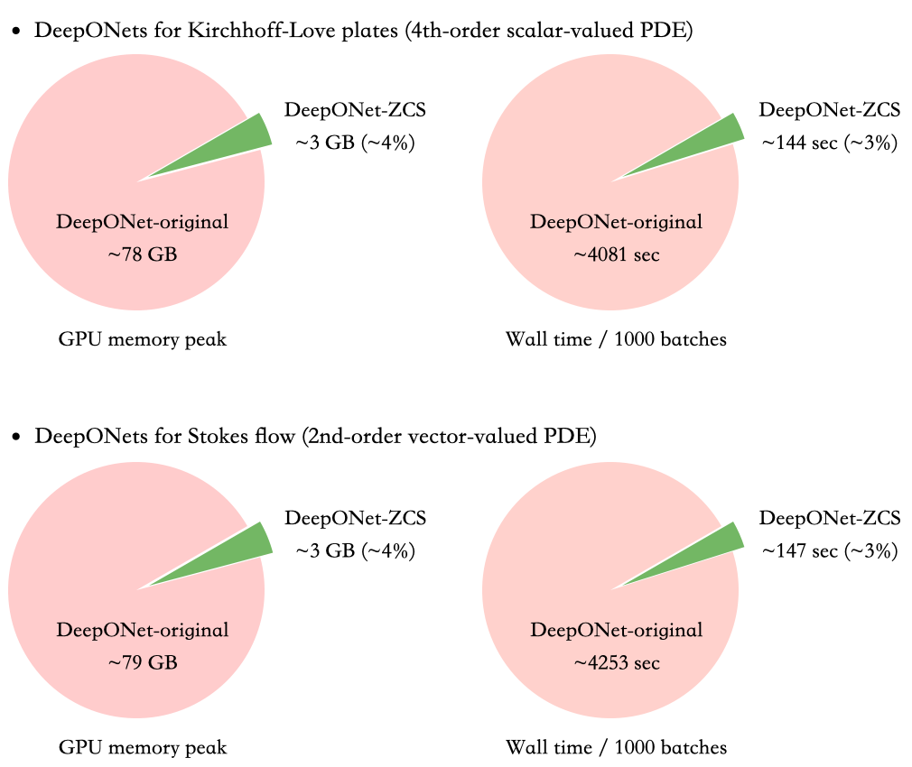

#### NOTE
**This repository is linked to the paper, with many features unnecessary for applications (
such as GPU memory and time profiling and reproducible experiments). 
If you want to use ZCS (based on DeepXDE) for your own applications, 
please directly use [the latest DeepXDE](https://github.com/lululxvi/deepxde) where ZCS has been built in.**


# ZeroCoordinateShift
 
This is the repository for the following paper: 

*Kuangdai Leng, Mallikarjun Shankar, Jeyan Thiyagalingam. Zero Coordinate Shift: Whetted Automatic Differentiation for Physics-informed Operator Learning. 
2023.* ([arxiv preprint](https://arxiv.org/abs/2311.00860))

Abstract:
Automatic differentiation (AD) is a critical step in physics-informed machine learning, required for computing the high-order derivatives of network output w.r.t. coordinates of collocation points. In this paper, we present a novel and lightweight algorithm to conduct AD for physics-informed operator learning, which we call the trick of Zero Coordinate Shift (ZCS). Instead of making all sampled coordinates as leaf variables, ZCS introduces only one scalar-valued leaf variable for each spatial or temporal dimension, simplifying the wanted derivatives from "many-roots-many-leaves" to "one-root-many-leaves" whereby reverse-mode AD becomes directly utilisable. It has led to an outstanding performance leap by avoiding the duplication of the computational graph along the dimension of functions (physical parameters). ZCS is easy to implement with current deep learning libraries; our own implementation is achieved by extending the DeepXDE package. We carry out a comprehensive benchmark analysis and several case studies, training physics-informed DeepONets to solve partial differential equations (PDEs) without data. The results show that ZCS has persistently reduced GPU memory consumption and wall time for training by an order of magnitude, and such reduction factor scales with the number of functions. As a low-level optimisation technique, ZCS imposes no restrictions on data, physics (PDE) or network architecture and does not compromise training results from any aspect. 



## Installation

The main dependencies are DeepXDE and PyTorch, which can be installed by
```bash
pip install -r requirements.txt
```

**NOTE**: There are some backward compatibility issues between DeepXDE 1.9 and 1.10. 
We set the version as 1.9.3 in `requirements.txt`.

## Training
Inside each example folder (`diffusion_reaction`, `burgers`, `KL_plates`), 
run the following command to see the arguments for training:
```bash
python main.py --help
```

Use the provided bash scripts to reproduce the results in the paper. 

Output files from training are also included. 
Use the following command to print the metrics
(replacing `burgers` with any other example folder):
```bash
python metrics.py burgers
```
